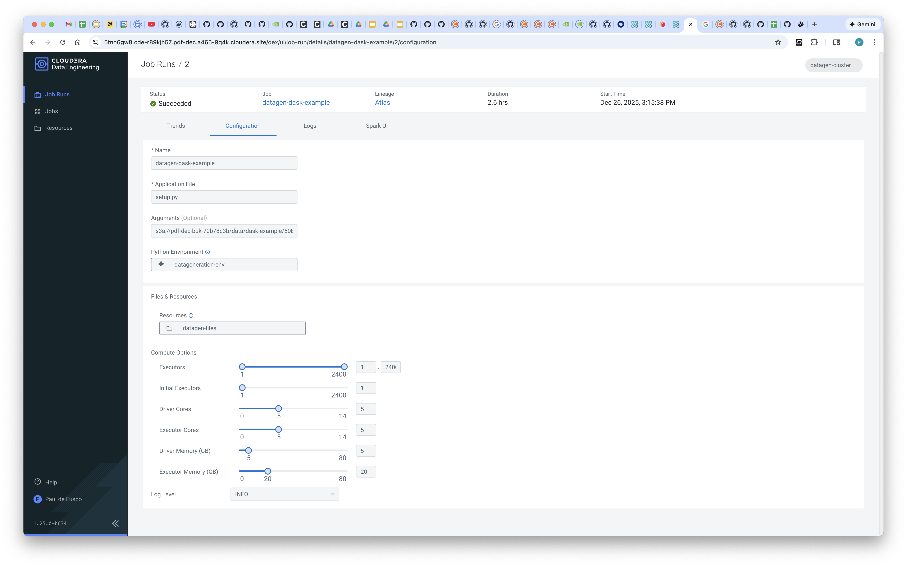
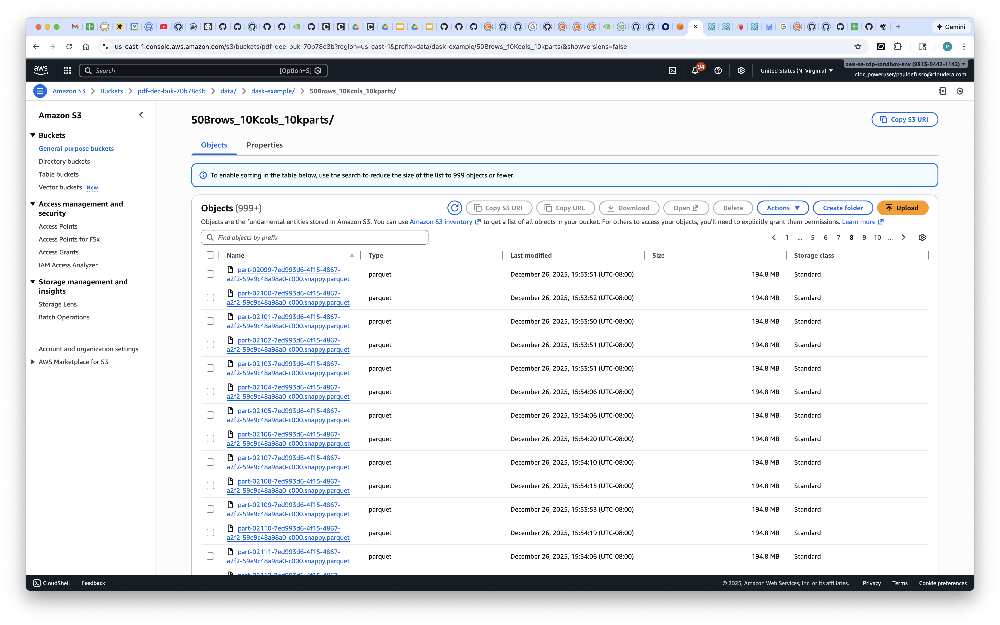
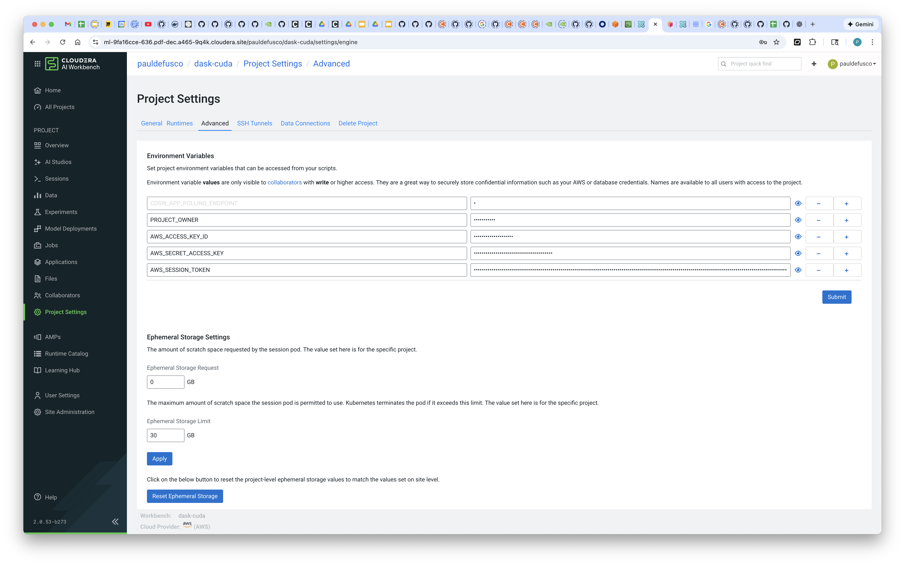
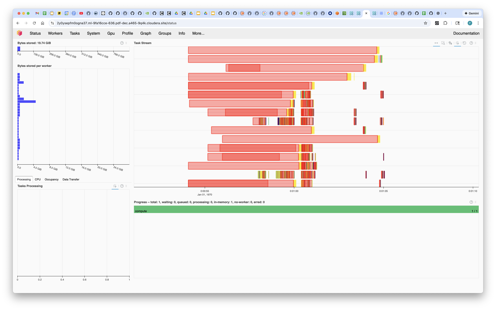
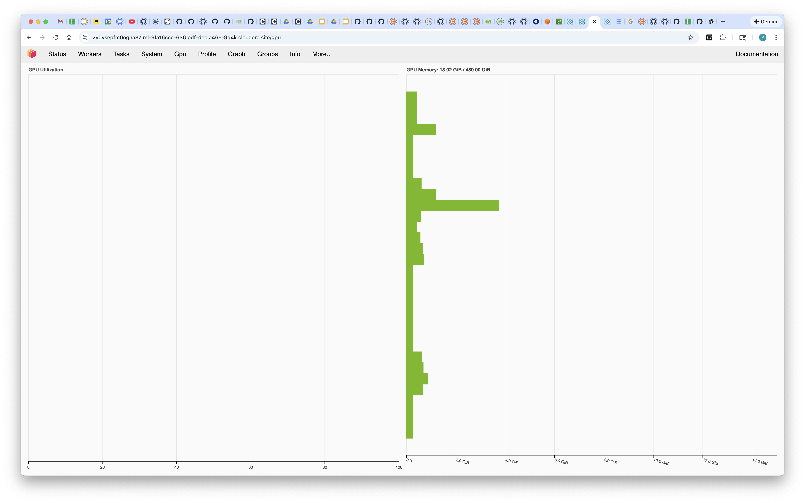
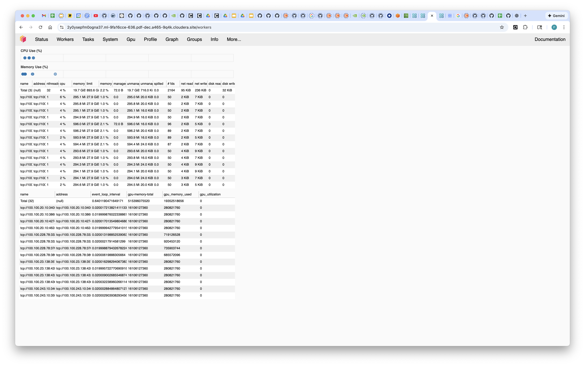
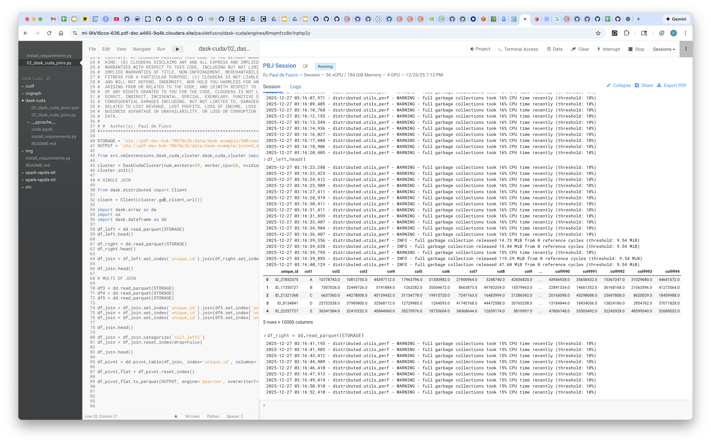
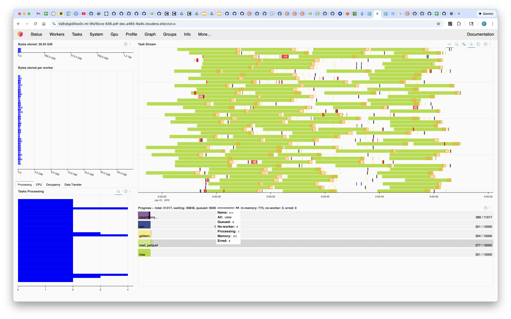
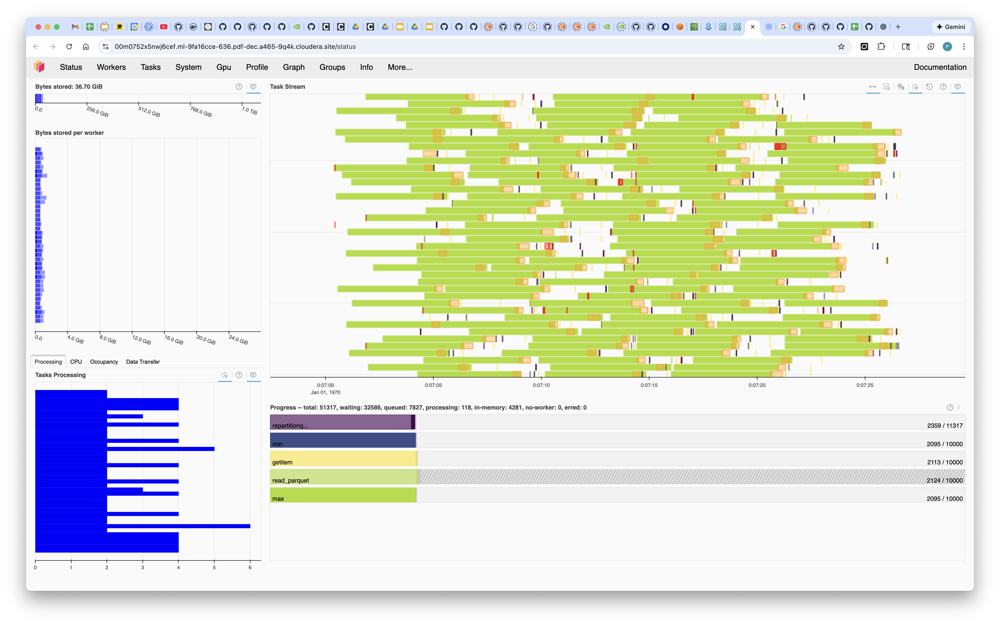

## Recommendations for Using Dask Cuda Clusters in Cloudera AI

### Objective

Deploying Dask Cuda Clusters on Kubernetes for distributed GPU workloads can require time, effort and money, especially at Enterprise scale. Among other things, you'd have to set up a Kubernetes cluster with GPU support, manage docker images, and dask cuda workers via complex deployment files.

Cloudera AI simplifies distributed compute use cases in the context of Machine Learning and AI. In this article you will learn how to easily deploy a Dask Cuda Cluster in Cloudera AI using the cmlextensions library.

### Backgrund Information

Dask CUDA clusters enable scalable parallel computing on NVIDIA GPUs by leveraging Dask, a flexible parallel computing framework, in conjunction with the power of CUDA for GPU acceleration. These clusters allow users to distribute computation across multiple GPUs, significantly speeding up data processing and machine learning workflows, particularly for tasks involving large datasets or complex algorithms.

Cloudera AI is a suite of artificial intelligence and machine learning solutions designed to help organizations harness the power of their data to drive innovation and optimize decision-making. Built on top of the Cloudera Data Platform, it enables businesses to seamlessly integrate AI and ML models into their existing data workflows, providing advanced analytics capabilities.

Enteprise Data Scientists and Engineers utilize Cloudera AI to launch distributed CPU and GPU sessions with frameworks such as Tensorflow, PyTorch, Spark and Dask. In this context, Cloudera AI simplifies the installation, configuration, and management of dependencies by providing out of the box, customizable Runtimes. These simplify the deployment of ML workflows and ensure consistency in model execution, from development to production.

The cmlextensions library is an open source package maintained by Cloudera AI developers that provides a wrapper for the CAI Workers SDK in order to easily allow the deployment of distributed CPU and GPU sessions. With cmlextensions, options CAI developers can deploy Dask Cuda clusters at scale.

### Requirements

In order to reproduce this example you will need:

* A CAI Workbench on Cloudera on Cloud or on Prem with GPU Nodes enabled. Version 2.0.47+ is recommended. This example is compatible with many Nvidia GPU types such as T4, V10, A100, H100, V100, etc. Make sure the Workbench configurations include a GPU Node Group with Nvidia GPU instances and an Autoscale Range of at least 0-10 GPU nodes.
* Optionally, if you want to run notebook ```02_dask_cuda_join.ipynb``` to test Dask Cuda dataframes at scale you will need a CDE Virtual Cluster to create the dataset as directed below.

### Setup

##### Optional: Create Datasets to Test Dask Cuda Dataframes at Scale

Using the CDE CLI, run the following commands:

```
# Set up CDE dependencies:

cde resource delete \
  --name datagen-setup

cde resource create \
  --name datagen-setup \
  --type files

cde resource upload \
  --name datagen-setup \
  --local-path 00_cde_datagen/setup.py \
  --local-path 00_cde_datagen/utils.py
```

```
# Create a Python Resource

cde resource create \
  --name datagen-py \
  --type files

cde resource upload \
  --name datagen-py \
  --local-path 00_cde_datagen/requirements.txt
```

Before running the next code snippet, set the CDP Data Lake Storage variable locally. This is where your data will be stored. For example, if you're creating the data in S3 you can use something like ```s3a://pdf-dec-buk-70b78c3b/data/dask-example/50Brows_10Kcols_10kparts```

```
# Create and run the job

cde job create \
  --name datagen-setup \
  --type spark \
  --mount-1-resource datagen-setup \
  --application-file setup.py \
  --python-env-resource-name datagen-py

cde job run \
  --name datagen-setup \
  --arg $cdp_data_lake_storage \
  --driver-cores 4 \
  --driver-memory "10g" \
  --executor-cores 5 \
  --executor-memory "20g"
```



Optionally navigate to the AWS S3 Console (or ADLS, HDFS or Ozone if that's what you used instead) and validate the data has been generated.

The datagen setup script should run in about three hours and will generate a parquet dataset with 50 Billion Rows, 10 Thousand Columns, across 10 thousand partitions using Spark. Each of the 10,000 partition files in S3 is about 185 MB in size for a total 1.85 TB for the whole dataset.



##### Create CAI Project

Create a CAI project and clone the repository located at this github URL: ```https://github.com/pdefusco/CAI_Rapids_Articles.git```

Optionally, if you execute notebook 2, set the following project environment variables to access your data from S3. You will need the AWS_ACCESS_KEY_ID, AWS_SECRET_ACCESS_KEY and AWS_SESSION_TOKEN.



### Code

##### Run 01_stress_tests.py

Launch a CAI Session with the following Resource Profile. Notice the vCPU and Memory depend on the Resource Profiles available in your Workbench, which can be modified by your Admin. It's important to use a high CPU and Memory profile such as the one below.

```
Editor: PBJ Workbench
Kernel: Python 3.10
Edition: Nvidia GPU
Version: 2025.01 or above
Spark Runtime Add-On: disabled
Resource Profile: 36 vCPU / 184 GiB Memory / 4 GPU
```

In the session, install Dask and CUDA requirements by running the ```install_requirements.py``` script.

Then, install the cml extensions package:

```
pip install git+https://github.com/cloudera/cmlextensions.git
```

Open ```01_stress_tests.py``` and familiarize yourself with the code. Follow along the instructions below understand the most important aspects of it.

First, deploy a Dask Cuda cluster with eight worker pods, each with four gpu's, by running the following code.

Shortly after running this you should notice the Dask Scheduler and Workers on the right side of the screen.

```
from src.cmlextensions.dask_cuda_cluster.dask_cuda_cluster import DaskCudaCluster

cluster = DaskCudaCluster(num_workers=8, worker_cpu=26, nvidia_gpu=4, worker_memory=120, scheduler_cpu=8, scheduler_memory=64)
cluster.init()
```


Connect to the cluster via the Client constructor. Also on the right side of the screen, notice the Cluster has started and the Client has connected successfully.

```
from dask.distributed import Client

client = Client(cluster.get_client_url())
```


Perform some basic data manipulations:

```
import dask.array as da

# Create a dask array from a NumPy array
x = da.from_array([[1, 2, 3], [4, 5, 6], [7, 8, 9]], chunks=(2, 2))

# Perform a computation on the dask array
y = (x + 1) * 2

# Submit the computation to the cluster for execution
future = client.submit(y.compute)

# Wait for the computation to complete and retrieve the result
result = future.result()

print(result)
```

Run the rest of the ```code.py``` script and monitor your workload in real time in the Dask Dashboard. Explore the Status, Workers, Info and GPU tabs to watch cluster utilization during execution.








##### Run 02_dask_cuda_joins.py

Kill the previous Session and launch a new one with the same Resource Profile. Open ```02_dask_cuda_joins.py``` and familiarize yourself with the code. This script demonstrates how to accelerate dataframe operations at scale with Dask Cuda including joins, pivots, and writes.

Before running the code update the Storage and Output locations at lines 40 and 41 according to the path where you have created the dataset and where you would like to write the final output after the dataframe joins.

Then, execute the code and monitor progress in the Dashboard.








### Recommendations

* The Dask Cuda Scheduler and Workers run in separate pods. Therefore, when launching the CAI Session for installing requirements and running the code above, a GPU is not required. However, a higher than usual amount of memory is recommended for installing RAPIDS dependencies as these can take a few minutes to install in your environments.

* This article was written in December 2025. Use the [RAPIDS selector tool at this site](https://docs.rapids.ai/install/) to locate the right version of CUDA for your environment and update the ```install_requirements.py``` script accordingly.

* When you deploy a CAI Session with a GPU, a GPU node rather than a CPU node is deployed. These typically come with higher than usual memory  resources. Therefore, feel free to request large amounts of memory when instantiating the Dask Cuda cluster object, especially if you are the only Workspace user.

* The source code for the cmlextensions package can be found on [github](https://github.com/cloudera/cmlextensions). For customizations, you're welcome to fork or directly load the source code in your environment.

* If you have any issues reaching the Dask Dashboard, you can try running this code and reaching the site provided in the output: ```print("https://"+os.environ["CDSW_ENGINE_ID"]+"."+os.environ["CDSW_DOMAIN"])```


## Summary and Next Steps

In this article you learned how to easily deploy a disributed GPU Dask Cuda Cluster on Kubernetes in Cloudera AI in just a few steps. For more information, blogs, and documentation please visit the following sites.

Here are some Cloudera blog posts and community articles about Cloudera AI:

- **From Machine Learning to AI: Simplifying the Path to Enterprise Intelligence**: This blog post discusses how Cloudera AI brings together tools like Cloudera AI Workbench and Cloudera AI Registry to operationalize AI at scale. [Link](https://www.cloudera.com/blog/business/from-machine-learning-to-ai-simplifying-the-path-to-enterprise-intelligence.html)

- **Cloudera AI overview**: This documentation provides an overview of Cloudera AI's capabilities, including its support for Python, R, and Spark-on-Kubernetes, enabling scale-out data engineering and machine learning. [Link](https://docs.cloudera.com/machine-learning/1.5.4/product/topics/ml-product-overview.html)

- **Using Cloudera AI Inference service**: This article explains how Cloudera AI Inference service provides a production-grade environment for hosting predictive and generative AI, addressing challenges like high availability and scalability. [Link](https://docs.cloudera.com/machine-learning/cloud/ai-inference/topics/ml-caii-use-caii.html?utm_source)

- **Cloudera AI on Cloud: Documentation**: This documentation details Cloudera AI's cloud-native machine learning platform, unifying self-service data science and data engineering in a single, portable service. [Link](https://docs.cloudera.com/machine-learning/cloud/index.html?utm_source)

- **Cloudera AI Inference Service**: This page highlights Cloudera AI Inference Service's features, including one-click deployment, robust security, and unified support for all AI inference needs. [Link](https://www.cloudera.com/products/machine-learning/ai-inference-service.html?utm_source=chatgpt.com)
