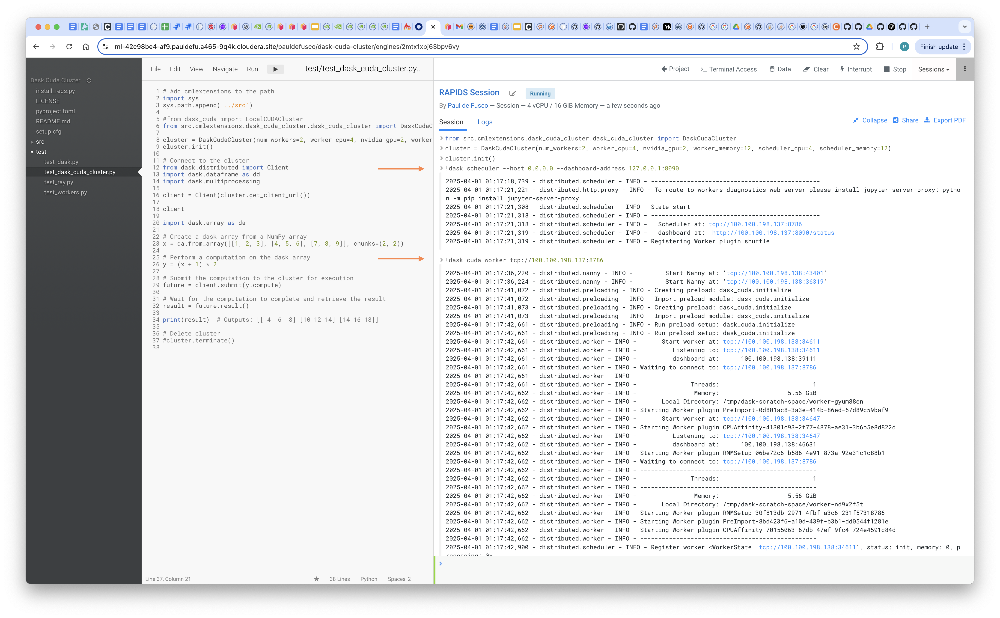
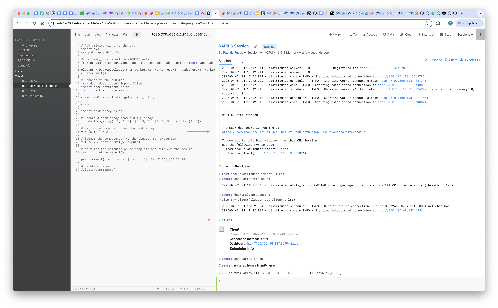
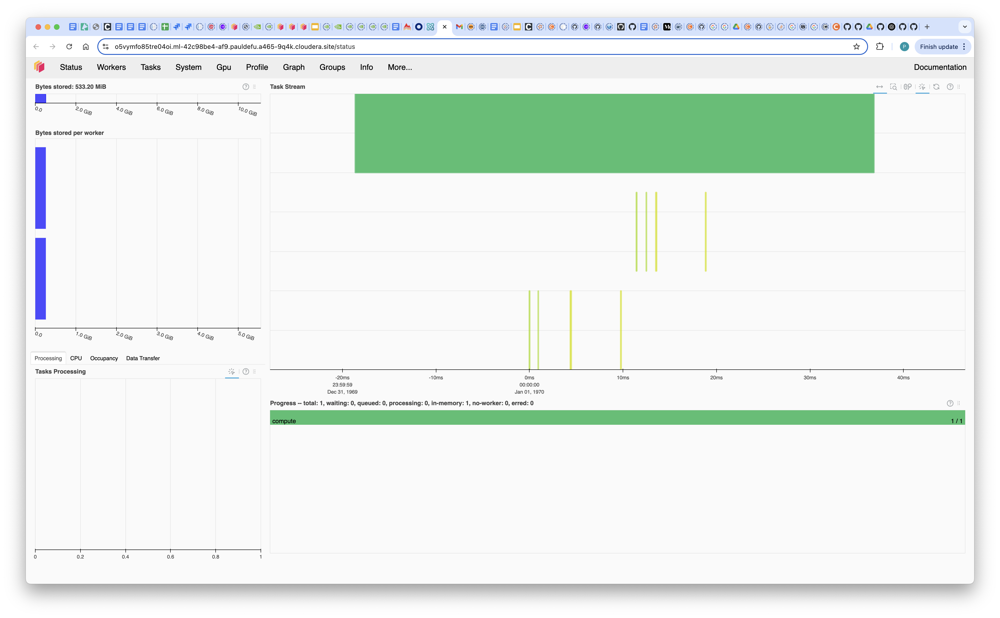
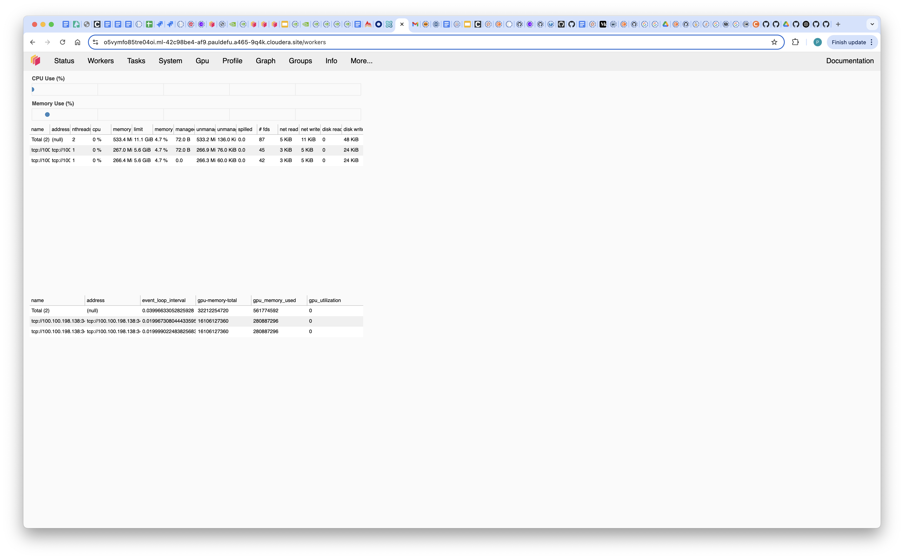

## Recommendations for Using Dask Cuda Clusters in Cloudera AI

### Objective

Deploying Dask Cuda Clusters on Kubernetes for distributed GPU workloads can require time, effort and money, especially at Enterprise scale. Among other things, you'd have to set up a Kubernetes cluster with GPU support, manage docker images, and dask cuda workers via complex deployment files.

Cloudera AI simplifies distributed compute use cases in the context of Machine Learning and AI. In this article you will learn how to easily deploy a Dask Cuda Cluster in Cloudera AI using the cmlextensions library.

### Backgrund Information

Dask CUDA clusters enable scalable parallel computing on NVIDIA GPUs by leveraging Dask, a flexible parallel computing framework, in conjunction with the power of CUDA for GPU acceleration. These clusters allow users to distribute computation across multiple GPUs, significantly speeding up data processing and machine learning workflows, particularly for tasks involving large datasets or complex algorithms.

Cloudera AI is a suite of artificial intelligence and machine learning solutions designed to help organizations harness the power of their data to drive innovation and optimize decision-making. Built on top of the Cloudera Data Platform, it enables businesses to seamlessly integrate AI and ML models into their existing data workflows, providing advanced analytics capabilities.

Enteprise Data Scientists and Engineers utilize Cloudera AI to launch distributed CPU and GPU sessions with frameworks such as Tensorflow, PyTorch, Spark and Dask. In this context, Cloudera AI simplifies the installation, configuration, and management of dependencies by providing out of the box, customizable Runtimes. These simplify the deployment of ML workflows and ensure consistency in model execution, from development to production.

The cmlextensions library is an open source package maintained by Cloudera AI developers that provides a wrapper for the CAI Workers SDK in order to easily allow the deployment of distributed CPU and GPU sessions. With cmlextensions, options CAI developers can deploy Dask Cuda clusters at scale.

### Requirements

In order to reproduce this example you will need:

* A CML Workspace on Cloudera on Cloud or on Prem with GPU Nodes enabled. Version 2.0.47+ is recommended.

### Setup

Create a CAI project and clone the repository located at this github URL: ```https://github.com/pdefusco/cmlextensions```

Launch a CML Session with the following Resource Profile:

```
Editor: PBJ Workbench
Kernel: Python 3.10
Edition: Nvidia GPU
Version: 2025.01 or above
Spark Runtime Add-On: disabled
Resource Profile: 4 vCPU / 16 GiB Memory / 0 GPU
```

In the session, install Dask and CUDA requirements by running the ```install_requirements.py``` script.

Then, install the cml extensions package:

```
pip install git+https://github.com/cloudera/cmlextensions.git
```

### Code

Deploy a Dask Cuda cluster with two worker pods, each with two gpu's, by running the following code.

Shortly after running this you should notice the Dask Scheduler and Workers on the right side of the screen.

```
from src.cmlextensions.dask_cuda_cluster.dask_cuda_cluster import DaskCudaCluster

cluster = DaskCudaCluster(num_workers=2, worker_cpu=4, nvidia_gpu=2, worker_memory=12, scheduler_cpu=4, scheduler_memory=12)
cluster.init()
```



Connect to the cluster via the Client constructor. Also on the right side of the screen, notice the Cluster has started and the Client has connected successfully.

```
from dask.distributed import Client

client = Client(cluster.get_client_url())
```



Perform some basic data manipulations:

```
import dask.array as da

# Create a dask array from a NumPy array
x = da.from_array([[1, 2, 3], [4, 5, 6], [7, 8, 9]], chunks=(2, 2))

# Perform a computation on the dask array
y = (x + 1) * 2

# Submit the computation to the cluster for execution
future = client.submit(y.compute)

# Wait for the computation to complete and retrieve the result
result = future.result()

print(result)
```

Monitor your work in the Dask Dashboard.





### Recommendations

* The Dask Cuda Scheduler and Workers run in separate pods. Therefore, when launching the CAI Session for installing requirements and running the code above, a GPU is not required. However, a higher than usual amount of memory is recommended for installing RAPIDS dependencies as these can take a few minutes to install in your environments.

* This article was written in March 2025. Use the [RAPIDS selector tool at this site](https://docs.rapids.ai/install/) to locate the right version of CUDA for your environment and update the ```install_requirements.py``` script accordingly.

* When you deploy a CML Session with a GPU, a GPU node rather than a CPU node is deployed. These typically come with higher than usual memory  resources. Therefore, feel free to request large amounts of memory when instantiating the Dask Cuda cluster object, especially if you are the only Workspace user.

* The source code for the cmlextensions package can be found on [github](https://github.com/cloudera/cmlextensions). For customizations, you're welcome to fork or directly load the source code in your environment.

* If you have any issues reaching the Dask Dashboard, you can try running this code and reaching the site provided in the output: ```print("https://"+os.environ["CDSW_ENGINE_ID"]+"."+os.environ["CDSW_DOMAIN"])```


## Summary and Next Steps

In this article you learned how to easily deploy a disributed GPU Dask Cuda Cluster on Kubernetes in Cloudera AI in just a few steps. For more information, blogs, and documentation please visit the following sites.

Here are some Cloudera blog posts and community articles about Cloudera AI:

- **From Machine Learning to AI: Simplifying the Path to Enterprise Intelligence**: This blog post discusses how Cloudera AI brings together tools like Cloudera AI Workbench and Cloudera AI Registry to operationalize AI at scale. [Link](https://www.cloudera.com/blog/business/from-machine-learning-to-ai-simplifying-the-path-to-enterprise-intelligence.html)

- **Cloudera AI overview**: This documentation provides an overview of Cloudera AI's capabilities, including its support for Python, R, and Spark-on-Kubernetes, enabling scale-out data engineering and machine learning. [Link](https://docs.cloudera.com/machine-learning/1.5.4/product/topics/ml-product-overview.html)

- **Using Cloudera AI Inference service**: This article explains how Cloudera AI Inference service provides a production-grade environment for hosting predictive and generative AI, addressing challenges like high availability and scalability. [Link](https://docs.cloudera.com/machine-learning/cloud/ai-inference/topics/ml-caii-use-caii.html?utm_source)

- **Cloudera AI on Cloud: Documentation**: This documentation details Cloudera AI's cloud-native machine learning platform, unifying self-service data science and data engineering in a single, portable service. [Link](https://docs.cloudera.com/machine-learning/cloud/index.html?utm_source)

- **Cloudera AI Inference Service**: This page highlights Cloudera AI Inference Service's features, including one-click deployment, robust security, and unified support for all AI inference needs. [Link](https://www.cloudera.com/products/machine-learning/ai-inference-service.html?utm_source=chatgpt.com)
