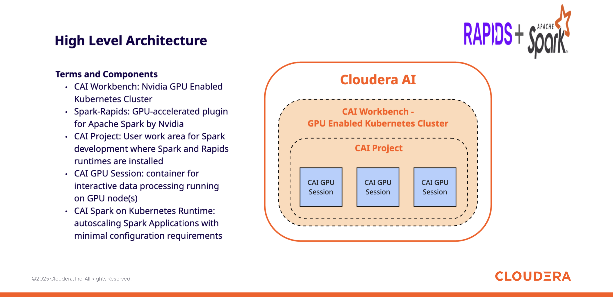
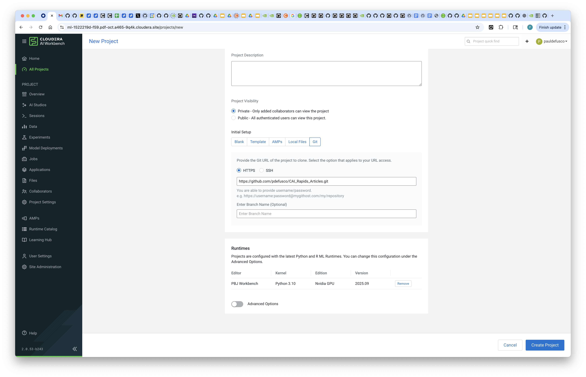
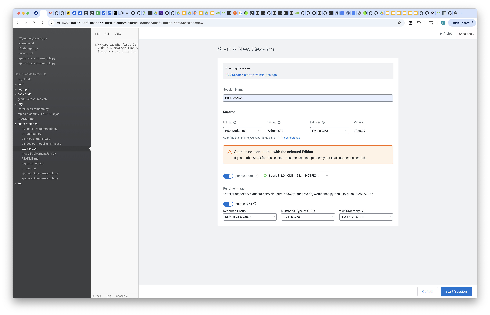
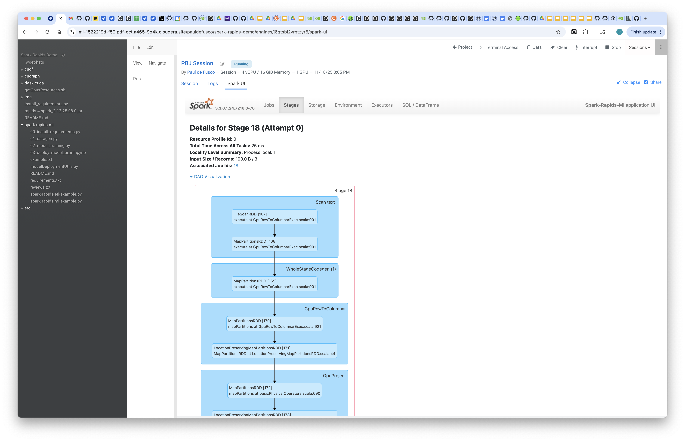
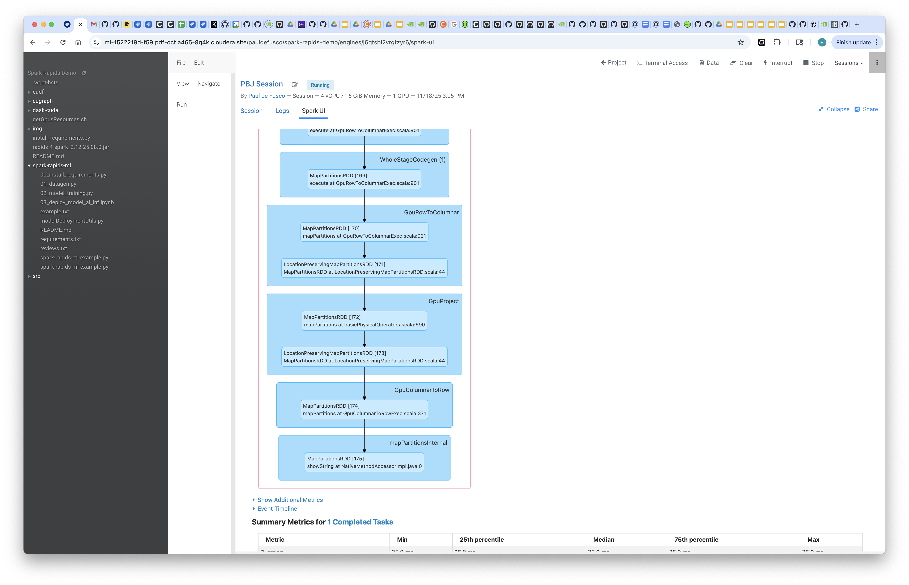

# Spark Rapids ETL in Cloudera AI



## Objective

In this tutorial you will learn how to leverage Spark Rapids with GPU acceleration in Cloudera AI.

## Motivation

Using Spark RAPIDS acceleration with GPUs in Cloudera AI enables organizations to dramatically speed up data processing and ETL workloads by offloading compute-intensive operations to GPUs. When combined with the Spark-on-Kubernetes runtime provided by Cloudera AI, users gain the flexibility of elastic, containerized Spark clusters that can scale on-demand, while fully leveraging GPU acceleration - with minimal configuration effort.

## Requirements

This example was built with Cloudera On Cloud Public Cloud Runtime 7.3.1, CAI Workbench 2.0.53, Python 3.10, a single V100 Nvidia GPU, the Cloudera Spark 3.3.0 DEX CDE 1.24 Runtime Hotfix 1 and Spark Rapids v25.08.0.

You can reproduce this tutorial in your CAI environment with the following:

* A CAI Environment in Private or Public Cloud.
* A PBJ or Python based IDE Runtime and the Spark 3.3.0 DEX CDE 1.24 Hotfix 1 Spark Add On.
* A Spark Rapids compatible GPU such as V100, T4, A10, A100, L4, H100, and B100.
* Ranger RAZ and Hadoop SQL policy permissions and IDBroker Mapping configurations for your CDP User.  

## Step by Step Instructions

#### 1. Create Project from Git Repository

Create a CAI Project by cloning the following git url: https://github.com/pdefusco/CAI_Rapids_Articles.git

When you create the project, make sure the Python 3.10 PBJ Runtime with Nvidia Drivers is present.



#### 2. Launch CAI Session

Next, launch a Cloudera AI Session with the following dependencies:

```
Editor: PBJ Workbench
Kernel: Python 3.10
Edition: Nvidia GPU
Spark Runtime Addon: Spark 3.3.0 DEX CDE 1.24.1 Runtime Hotfix 1
Enable GPU: Select one gpu card
Resource Profile: 4 vCPU / 16 GiB Mem
```

You can ignore the warning about Spark and GPU compatibility.



#### 3. Install Requirements

Run script ```00_install_requirements.py``` to install dependencies for this project.

#### 4. Create Synthetic Data

Open script ```01_datagen.py``` and modify lines 171 and 172 with the Spark Data Connection and Storage Location reflecting your CDP Environment.

You can find the Spark Data Connection name if you click on the "Data" icon within a session.
You can find the Storage Location variable from the Management Console (ask your CDP Admin if you're having trouble finding it). Make sure you are using the "data" folder.

```
CONNECTION_NAME = "pdf-oct-aw-dl"
STORAGE = "s3a://pdf-oct-buk-a163bf71/data/"
```

Run the script in order to create the synthetic data.

#### 5. Run Spark Rapids ETL Script

Open script ```02_spark_rapids_etl.py```. At line 85 replace ```s3a://pdf-oct-buk-a163bf71/data/``` with the same value you used for the STORAGE variable in the previous script. This will authenticate the SparkSession with the DataLake. No other code changes are required.

Notice the script ends with an ```.explain()``` method call. Look at the output to confirm the Spark Physical Plan is leveraging GPU acceleration.

About the code, notice the SparkSession object is instantiated with the following Spark options.

```
import os, warnings, sys, logging
from pyspark.sql import SparkSession

spark = SparkSession\
  .builder\
  .appName("Spark-Rapids-Ml")\
  .config('spark.dynamicAllocation.enabled', 'false')\
  .config('spark.executor.cores', 1)\
  .config('spark.executor.resource.gpu.amount', 1)\
  .config('spark.executor.instances', 1)\
  .config('spark.executor.memory', '16g')\
  .config('spark.rapids.memory.pinnedPool.size', '2G')\
  .config('spark.plugins', 'com.nvidia.spark.SQLPlugin')\
  .config("spark.jars.packages", "com.nvidia:rapids-4-spark_2.12:25.08.0")\
  .config("spark.executor.resource.gpu.discoveryScript","/home/cdsw/getGpusResources.sh")\
  .config("spark.executor.resource.gpu.vendor", "nvidia.com")\
  .config("spark.rapids.shims-provider-override", "com.nvidia.spark.rapids.shims.spark330.SparkShimServiceProvider")\
  .config("spark.driver.memory","10g") \
  .config("spark.eventLog.enabled","true") \
  .config("spark.rapids.sql.concurrentGpuTasks", "2") \
  .config("spark.sql.files.maxPartitionBytes", "256m") \
  .config("spark.locality.wait", "0") \
  .config("spark.sql.adaptive.enabled", "true") \
  .config("spark.rapids.memory.pinnedPool.size", "2g") \
  .config("spark.sql.adaptive.advisoryPartitionSizeInBytes", "1g") \
  .config("spark.executor.memoryOverhead", "3g") \
  .config("spark.kryo.registrator", "com.nvidia.spark.rapids.GpuKryoRegistrator") \
  .config("spark.rapids.sql.enabled", "true") \
  .config("spark.rapids.sql.incompatibleOps.enabled", "true") \
  .config("spark.rapids.sql.udfCompiler.enabled", "true") \
  .config("spark.rapids.sql.format.csv.read.enabled", "true") \
  .config("spark.rapids.sql.format.csv.enabled", "true") \
  .config("spark.rapids.sql.variableFloatAgg.enabled", "true") \
  .config("spark.rapids.sql.explain", "ALL") \
  .config("spark.sql.hive.convertMetastoreParquet", "true") \
  .config("spark.rapids.sql.castFloatToString.enabled", "true") \
  .config("spark.rapids.sql.csv.read.float.enabled", "true") \
  .config("spark.rapids.sql.castStringToFloat.enabled", "true") \
  .config("spark.hadoop.fs.s3a.custom.signers", "RazS3SignerPlugin:org.apache.ranger.raz.hook.s3.RazS3SignerPlugin:org.apache.ranger.raz.hook.s3.RazS3SignerPluginInitializer") \
  .config("spark.hadoop.fs.s3a.s3.signing-algorithm", "RazS3SignerPlugin") \
  .config("spark.hadoop.fs.s3a.aws.credentials.provider", "org.apache.ranger.raz.hook.s3.RazCredentialProvider") \
  .config("spark.kubernetes.executor.podTemplateFile", "/tmp/spark-executor.json") \
  .config("spark.kerberos.access.hadoopFileSystems", "s3a://pdf-oct-buk-a163bf71/data/") \
  .getOrCreate()

:: loading settings :: url = jar:file:/runtime-addons/spark330-24.1-h1-zd1ok/opt/spark/jars/ivy-2.5.1.jar!/org/apache/ivy/core/settings/ivysettings.xml
Ivy Default Cache set to: /home/cdsw/.ivy2/cache
The jars for the packages stored in: /home/cdsw/.ivy2/jars
com.nvidia#rapids-4-spark_2.12 added as a dependency
:: resolving dependencies :: org.apache.spark#spark-submit-parent-f894b50f-faaa-42fd-b7fd-7465bdf4820e;1.0
	confs: [default]
	found com.nvidia#rapids-4-spark_2.12;25.08.0 in central
:: resolution report :: resolve 235ms :: artifacts dl 16ms
	:: modules in use:
	com.nvidia#rapids-4-spark_2.12;25.08.0 from central in [default]
	---------------------------------------------------------------------
	|                  |            modules            ||   artifacts   |
	|       conf       | number| search|dwnlded|evicted|| number|dwnlded|
	---------------------------------------------------------------------
	|      default     |   1   |   0   |   0   |   0   ||   1   |   0   |
	---------------------------------------------------------------------
:: retrieving :: org.apache.spark#spark-submit-parent-f894b50f-faaa-42fd-b7fd-7465bdf4820e
	confs: [default]
	0 artifacts copied, 1 already retrieved (0kB/20ms)
Setting spark.hadoop.yarn.resourcemanager.principal to pauldefusco
```

You can read data from a Hive table. Next, read the data you generated in script 01_datagen.py:

```
read_df = spark.read.table("DataLakeTable")
Hive Session ID = 6b5f7e49-e326-449e-8066-dd9906353c7c
read_df.show()
[Stage 0:>                                                          (0 + 1) / 1]
+----+-------------------+--------------------+----------------+------------------------+-----------------------+---------------------------+----------------+--------------------+----------------------+----------------+---------+--------+------------------+---------+
| age|credit_card_balance|bank_account_balance|mortgage_balance|sec_bank_account_balance|savings_account_balance|sec_savings_account_balance|total_est_nworth|primary_loan_balance|secondary_loan_balance|uni_loan_balance|longitude|latitude|transaction_amount|fraud_trx|
+----+-------------------+--------------------+----------------+------------------------+-----------------------+---------------------------+----------------+--------------------+----------------------+----------------+---------+--------+------------------+---------+
|75.0|            21305.0|            16840.01|        28308.01|                51828.01|               355457.0|                   308440.0|        474441.0|              422.01|              31642.01|         3399.01|    -15.0|    52.0|           7717.01|        0|
|87.0|             4287.0|            15265.01|        596398.0|                21743.01|               402794.0|                   321811.0|        316707.0|             3748.01|              367266.0|         1615.01|     18.0|    72.0|           6343.01|        1|
|90.0|            15322.0|              137.01|        858722.0|                22198.01|               298947.0|                   363054.0|        247698.0|             1551.01|              418030.0|         3660.01|      1.0|    10.0|           9962.01|        0|
|62.0|             8093.0|             6776.01|        919655.0|                55062.01|               370276.0|                   70806.01|        132810.0|             4534.01|              337194.0|         5500.01|    125.0|    15.0|            243.01|        0|
|22.0|             6363.0|            59697.01|        594999.0|                44478.01|              184480.02|                   282373.0|        361227.0|             3380.01|               2801.01|         8737.01|    117.0|     3.0|          26336.01|        0|
|43.0|            25271.0|             5040.01|        618823.0|                14344.01|               44727.01|                   437211.0|         88774.0|             2247.01|             146704.02|         1717.01|    -69.0|    36.0|          10726.01|        0|
|79.0|             6824.0|            78162.01|        391480.0|                 7645.01|               427205.0|                   443750.0|        224006.0|             4443.01|             153462.02|         4079.01|     71.0|   -15.0|           3906.01|        0|
|90.0|             1032.0|            29912.01|        361694.0|                40073.01|               324143.0|                   492604.0|        491594.0|             1452.01|              386708.0|         9567.01|     19.0|   -49.0|          17622.01|        0|
```

You can also read data from local project files. Next, read a simple txt file and execute the ETL logic with GPU acceleration.

```
from pyspark.sql import functions as F
Define the path to your text file

file_path = "/home/cdsw/spark-rapids-ml/example.txt"  # Adjust if your file is in a different location
Read the text file into a DataFrame

df = spark.read.csv(file_path)
df.show()
+--------------------+
|                 _c0|
+--------------------+
|This is the first...|
|Here's another li...|
|And a third line ...|
+--------------------+

read_df = spark.read.table(“DataLakeTable”) read_df.show()

from pyspark.sql import functions as F
Define the path to your text file

file_path = "/home/cdsw/spark-rapids-ml/example.txt"  # Adjust if your file is in a different location
Read the text file into a DataFrame

df = spark.read.text(file_path)
— Step 1: Filter to keep only lines containing “line” (case-insensitive) — The output is a new filtered DataFrame ‘df_step1’

df_step1 = df.filter(df["value"].rlike("(?i)line"))
print("--- Step 1: Filtered for 'line' ---")
--- Step 1: Filtered for 'line' ---
df_step1.show(truncate=False)
+------------------------------------+
|value                               |
+------------------------------------+
|This is the first line of text.     |
|Here's another line with some words.|
|And a third line for good measure.  |
+------------------------------------+

read_df = spark.read.table(“DataLakeTable”) read_df.show()

from pyspark.sql import functions as F
Define the path to your text file

file_path = "/home/cdsw/spark-rapids-ml/example.txt"  # Adjust if your file is in a different location
Read the text file into a DataFrame

df = spark.read.text(file_path)
— Step 1: Filter to keep only lines containing “line” (case-insensitive) — The output is a new filtered DataFrame ‘df_step1’

df_step1 = df.filter(df["value"].rlike("(?i)line"))
print("--- Step 1: Filtered for 'line' ---")
--- Step 1: Filtered for 'line' ---
df_step1.show(truncate=False)
+------------------------------------+
|value                               |
+------------------------------------+
|This is the first line of text.     |
|Here's another line with some words.|
|And a third line for good measure.  |
+------------------------------------+

— Step 2: From the results of Step 1, filter out lines that contain “apache” — The input is ‘df_step1’, the output is ‘df_step2’

df_step2 = df_step1.filter(~df_step1["value"].contains("apache"))
print("--- Step 2: Filtered OUT 'apache' ---")
--- Step 2: Filtered OUT 'apache' ---
df_step2.show(truncate=False)
+------------------------------------+
|value                               |
+------------------------------------+
|This is the first line of text.     |
|Here's another line with some words.|
|And a third line for good measure.  |
+------------------------------------+

— Step 3: From the results of Step 2, transform the data by splitting the lines into an array of words — The input is ‘df_step2’, the output is ‘df_step3’

df_step3 = df_step2.select(F.split(df_step2["value"], " ").alias("words_array"))
print("--- Step 3: Transformed into array of words ---")
--- Step 3: Transformed into array of words ---
df_step3.show(truncate=False)
+-------------------------------------------+
|words_array                                |
+-------------------------------------------+
|[This, is, the, first, line, of, text.]    |
|[Here's, another, line, with, some, words.]|
|[And, a, third, line, for, good, measure.] |
+-------------------------------------------+

— Step 4: From the results of Step 3, filter rows where the word array has more than 2 elements — The input is ‘df_step3’, the output is ‘final_df’

final_df = df_step3.filter(F.size(df_step3["words_array"]) > 2)
print("--- Step 4: Filtered for arrays with size > 2 (Final Result) ---")
--- Step 4: Filtered for arrays with size > 2 (Final Result) ---
final_df.show(truncate=False)
+-------------------------------------------+
|words_array                                |
+-------------------------------------------+
|[This, is, the, first, line, of, text.]    |
|[Here's, another, line, with, some, words.]|
|[And, a, third, line, for, good, measure.] |
+-------------------------------------------+

final_df.explain()
== Physical Plan ==
GpuColumnarToRow false
+- GpuProject [split(value#226,  , -1,  , false) AS words_array#241], true
   +- GpuRowToColumnar targetsize(1073741824)
      +- *(1) Filter (((isnotnull(value#226) AND RLIKE(value#226, (?i)line)) AND NOT Contains(value#226, apache)) AND (size(split(value#226,  , -1), true) > 2))
         +- FileScan text [value#226] Batched: false, DataFilters: [isnotnull(value#226), RLIKE(value#226, (?i)line), NOT Contains(value#226, apache), (size(split(v..., Format: Text, Location: InMemoryFileIndex(1 paths)[file:/home/cdsw/spark-rapids-ml/example.txt], PartitionFilters: [], PushedFilters: [IsNotNull(value), Not(StringContains(value,apache))], ReadSchema: struct<value:string>
```

#### 6. Validate GPU utilization in the Spark UI

You can also explore the Spark UI and validate GPU utilization from there.






## Summary & Next Steps

In this project you learned about GPU accelerated ETL with Spark Rapids in Cloudera AI. You are encouraged to fork and reuse the code above in your environment.

**Additional Resources & Tutorials**
Explore these helpful tutorials and blogs to learn more about Spark Rapids and Cloudera AI:

* **Cloudera – “Cloudera Supercharges the Enterprise Data Cloud with NVIDIA”** — describes how Cloudera’s platform leverages the RAPIDS Accelerator to speed up ETL, Spark SQL, and analytics. ([blog.cloudera.com][1])
* **Cloudera – “NVIDIA RAPIDS in Cloudera Machine Learning”** — technical blog on how RAPIDS (cuDF, cuML, etc.) is integrated in Cloudera ML for data engineering + feature engineering. ([Cloudera][2])
* **NVIDIA – “RAPIDS Accelerator for Apache Spark v21.06 Release”** — details the 21.06 release, including ETL‑relevant operator support and profiling. ([NVIDIA Developer][3])
* **NVIDIA – “GPUs for ETL? Run Faster, Less Costly Workloads with NVIDIA RAPIDS Accelerator for Apache Spark …”** — shows a real-world ETL job on Spark + RAPIDS, cost-savings + speed. ([NVIDIA Developer][4])
* **NVIDIA – “RAPIDS Accelerator for Apache Spark Release v21.10”** — outlines major performance improvements, nested data types, and I/O support. ([NVIDIA Developer][5])
* **NVIDIA – “Saving Green: Accelerated Analytics Cuts Costs and Carbon”** — energy-efficiency and cost-reduction benefits for Spark ETL using RAPIDS. ([NVIDIA Blogs][6])
* **Cloudera / NVIDIA Joint (Whitepaper)** – *Turbocharge your ETL pipelines with NVIDIA GPUs and Cloudera Data Platform*. ([Cloudera][7])

[1]: https://blog.cloudera.com/cloudera-supercharges-the-enterprise-data-cloud-with-nvidia/?utm_source=chatgpt.com "Cloudera Supercharges the Enterprise Data Cloud with NVIDIA | Cloudera Blog"
[2]: https://www.cloudera.com/blog/technical/nvidia-rapids-in-cloudera-machine-learning.html?utm_source=chatgpt.com "NVIDIA RAPIDS in Cloudera Machine Learning | Blog | Cloudera"
[3]: https://developer.nvidia.com/blog/rapids-accelerator-for-apache-spark-v21-06-release/?utm_source=chatgpt.com "RAPIDS Accelerator for Apache Spark v21.06 Release | NVIDIA Technical Blog"
[4]: https://developer.nvidia.com/blog/gpus-for-etl-run-faster-less-costly-workloads-with-nvidia-rapids-accelerator-for-apache-spark-and-databricks/?utm_source=chatgpt.com "GPUs for ETL? Run Faster, Less Costly Workloads with NVIDIA RAPIDS Accelerator for Apache Spark and Databricks | NVIDIA Technical Blog"
[5]: https://developer.nvidia.com/blog/rapids-accelerator-for-apache-spark-release-v21-10/?utm_source=chatgpt.com "RAPIDS Accelerator for Apache Spark Release v21.10 | NVIDIA Technical Blog"
[6]: https://blogs.nvidia.com/blog/spark-rapids-energy-efficiency/?utm_source=chatgpt.com "Saving Green: Accelerated Analytics Cuts Costs and Carbon | NVIDIA Blog"
[7]: https://www.cloudera.com/content/dam/www/marketing/resources/partners/whitepapers/turbocharge-your-etl-pipelines-with-nvidia-gpus-and-cloudera-data-platform.pdf?daqp=true&utm_source=chatgpt.com "WHITE PAPER"
